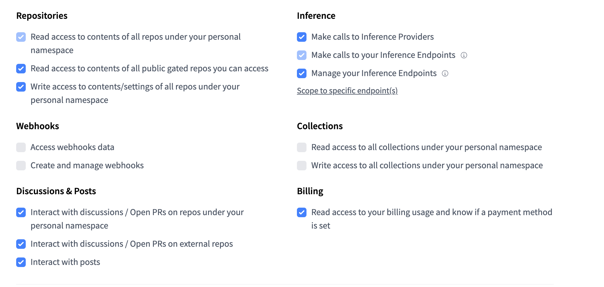

# NEUROGRAPH

# KGE-Augmented LLM: Reducción de Alucinaciones mediante Grafos de Conocimiento

## Descripción

Este proyecto implementa un sistema end-to-end que combina **Knowledge Graph Embeddings (KGE)** con **modelos de lenguaje grandes (LLMs)** para reducir alucinaciones mediante inyección de conocimiento estructurado. El sistema transforma un grafo RDF de gestión de incidencias en representaciones entrenables que sirven como contexto verificable para guiar las respuestas del LLM.

---

## Arquitectura del Pipeline

```
data/filtrado.ttl  (grafo RDF con ~60K incidencias)
        │
        ▼
  Fase 1 — Parseo RDF → tripletas TSV (train/valid/test)
        │
        ▼
  Fase 2 — Entrenamiento KGE TransE (PyKEEN, GPU A100)
        │
        ▼
  Fase 3 — Link prediction: inferencia de relaciones latentes
        │
        ▼
  Fase 4 — Creación guiada de incidencias (CBR + KGE + LLM conversacional)
```

**Dominio**: Sistema de gestión de incidencias técnicas en español.
**Entidades**: incidencias, técnicos (internos/externos), clientes, grupos/equipos/categorías de soporte, estados, tipos, orígenes.

---

## Requisitos Previos

- Python 3.11
- pip
- Git
- Hardware compatible con VLLM (GPU NVIDIA recomendada)

---

## Instalación

### 1. Crear un entorno virtual

```bash
python3 -m venv venv
source venv/bin/activate
```

### 2. Instalar dependencias

```bash
pip install -r requirements.txt
```

### 3. Configurar Hugging Face 🤗

Instala y configura el CLI de Hugging Face:

```bash
pip install huggingface-hub
hf auth login
```

**Obtener tu token de Hugging Face:**

- Ve a https://huggingface.co/settings/tokens
- Crea un nuevo token con permisos de lectura 🔑
- Usa la configuración mostrada en la imagen:



- Introduce el token cuando se te solicite ✍️

---

## Configuración de Servidores

### Servidor VLLM

Arranca el servidor en una terminal separada (requerido para las fases que usan LLM):

```bash
vllm serve meta-llama/Meta-Llama-3-8B-Instruct \
    --port 8000 \
    --dtype float16 \
    --max-model-len 4096 \
    --tool-call-parser llama3_json
```

---

## Ejecución del Pipeline paso a paso

### Paso 0 — Generar el corpus de evaluación (solo si no existe)

```bash
python src/generate_corpus.py
```

Genera `data/corpus/qa_corpus.json` con ~3.700 preguntas 1-hop y ~490 cadenas multi-hop en español. Este corpus se usa para evaluar la calidad de las respuestas del LLM en las fases posteriores.

---

### Paso 1 — Parsear el grafo RDF a tripletas TSV

```bash
python src/run_pipeline.py --phase 1
```
---

### Paso 2 — Entrenar el modelo KGE (TransE por defecto)

```bash
python src/run_pipeline.py --phase 2
```

**Otras opciones**:

Elegir otro modelo:
```bash
python src/run_pipeline.py --phase 2 --kge-model DistMult
python src/run_pipeline.py --phase 2 --kge-model ComplEx
```

Entrenar los tres modelos a la vez:
```bash
python src/run_pipeline.py --phase 2 --all-models
```

Ajustar hiperparámetros:
```bash
python src/run_pipeline.py --phase 2 --epochs 300 --dim 128 --device cuda
```

---

### Paso 3 — Inferencia de relaciones latentes (link prediction)

```bash
python src/run_pipeline.py --phase 3
```
---

### Paso 4 — Crear una incidencia guiada (CBR + KGE + LLM)

**Sin LLM** (menú numerado, no requiere vLLM):
```bash
python src/run_pipeline.py --phase create_incident --no-llm
```

**Con LLM conversacional** (requiere vLLM corriendo en `localhost:8000`):
```bash
python src/run_pipeline.py --phase create_incident
```

**Cambiar el modelo KGE**:
```bash
python src/run_pipeline.py --phase create_incident --kge-model DistMult
```

---

### Pipeline completo (fases 1 → 2 → 3 → create_incident)

```bash
python src/run_pipeline.py --phase all
```

